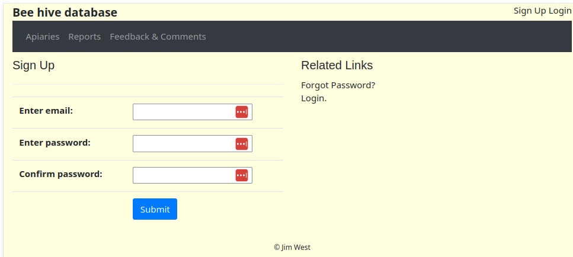
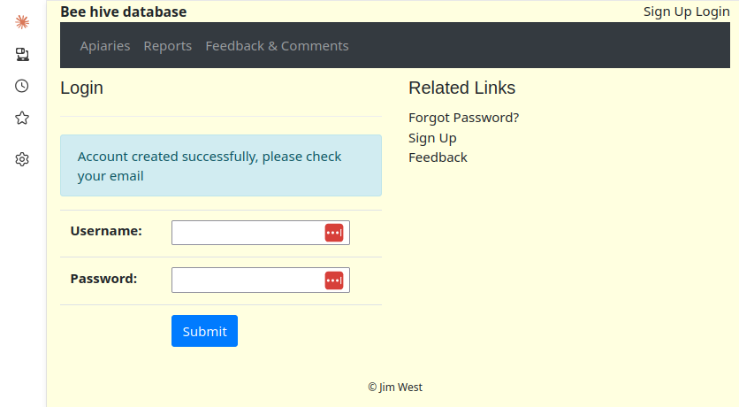
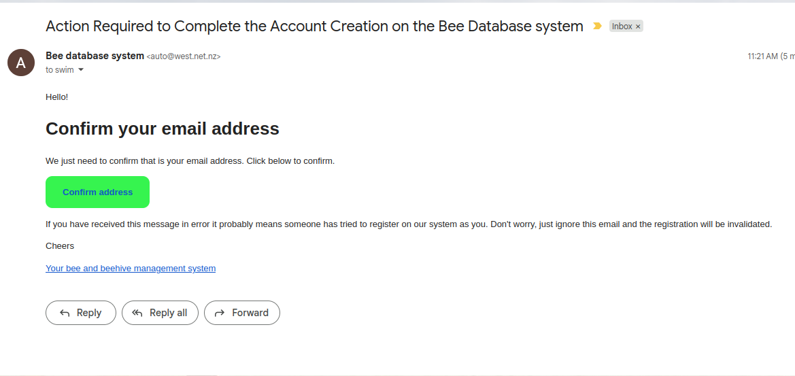
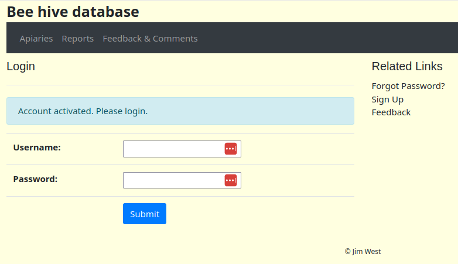
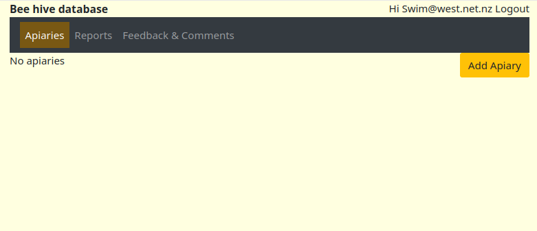

# Registering (creating a user for yourself)

To create a user on the bee database system go to the link here:
[Sign up](https://beedb.west.net.nz/beedb/signup/)

Enter your email address and choose a password for yourself. Remember this password, the best option is to store it in a password manager if you use one.

Then press 'Submit', and you should see this:

Then check yupr email. You should find an email that looks similar to this:

Click on the green 'Confirm address' button. This should take you back to the web, let you know your account has been activated and prompt you to login.

Login with your email address and password. You will then come tou your 'Home' screen which will show you a list of your apiaries. But as you don't have any yet, click on the 'Add Apiary' link to get started.

